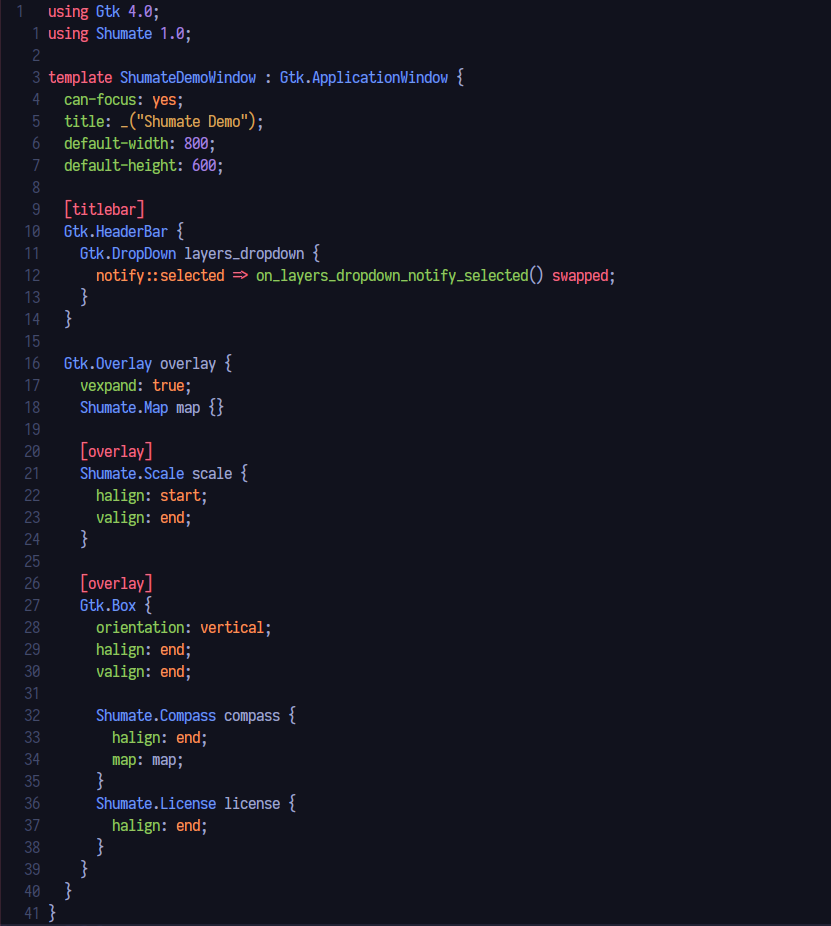

> [!IMPORTANT]
> **This repository has been archived in favour of the Blueprint grammar in [Treesitter](https://github.com/nvim-treesitter/nvim-treesitter).**

---

# vim-blueprint-syntax

A Vim plugin that provides syntax highlighting for GTK Blueprint files.

Links for Blueprint:
 - [Documentation](https://jwestman.pages.gitlab.gnome.org/blueprint-compiler)
 - [Repository](https://gitlab.gnome.org/jwestman/blueprint-compiler)


## Usage

To use the plugin, install it with your favourite plugin manager, e.g. packer.nvim:
```lua
use 'thetek42/vim-blueprint-syntax'
```

<br><br>

**Note:** This plugin is not complete whatsoever. It lacks some of the syntax that Blueprint provides as well as some other useful stuff (auto indents etc). Feel free to open an issue or a pull request about possible changes or improvements to the plugin. This was also the first Vim syntax highlighting plugin that I created, so there might be a couple of bugs and rough edges with it.

<br>

## Preview


